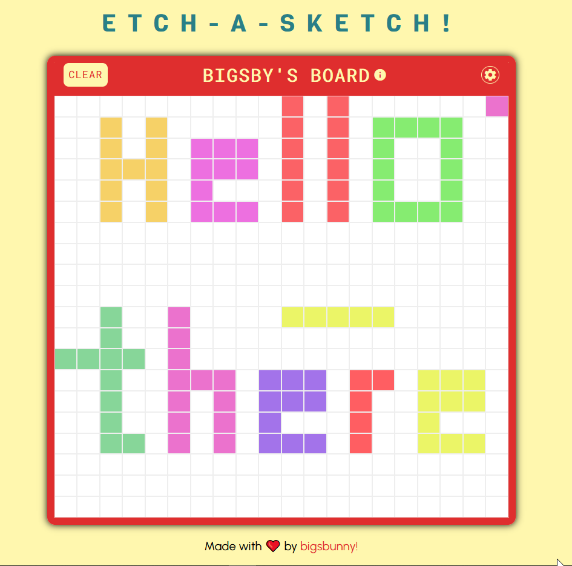

# ETCH-A-SKETCH!

Etch-a-Sketch is a website that allows you to make pixelated drawings in a grid of squares. I built this website primarily to brush up on my CSS and DOM manipulation skills, and learn various other things along the way.

### Things yet to be added/changed -
- [ ] Provide a 'click' option to color pixels, instead of just hovering.
- [ ] Change the background, and use gradients instead.

Built by -  
[Bighnesh Sahoo](https://github.com/bigsbunny)
